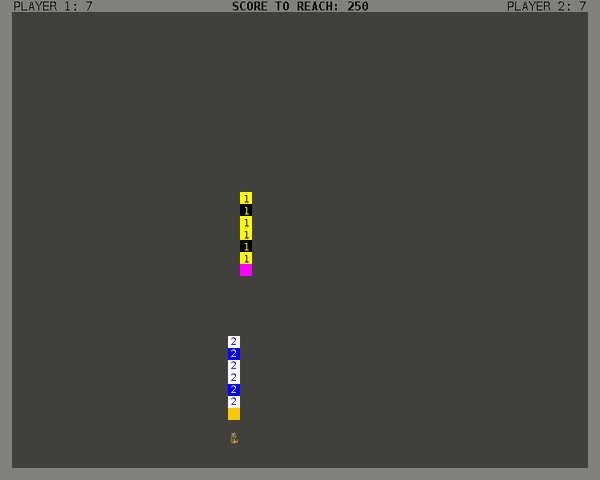
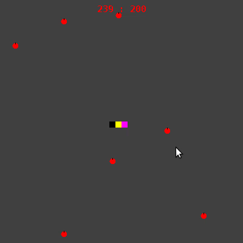

# Snake
Implementation of the famous game "Snake".

It is based on a project in the 2nd semester of the bioinformatics bachelors course which was to implement a basic single player game of Snake.

This project contains a mode where two players can playe against each other or against an artificial intelligence.

And an approach to a open world multiplayer snake game.

## Artificial Intelligence
The AStar pathfinding algorithm is used to detect the shortest path to the next point of interest.

  

## Open World Snake
This is an approach to create an open world game of Snake.

  

